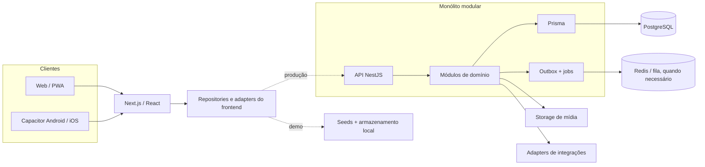
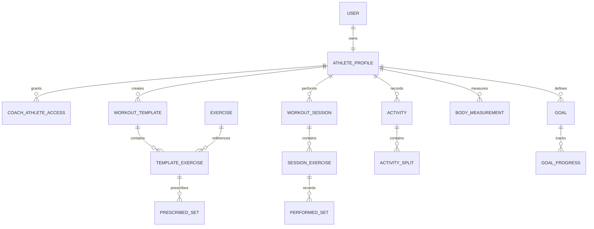

# Arquitetura do OLYMPUS AI

## 1. Objetivo e decisões principais

O OLYMPUS AI unifica treino de força, atividades de endurance, metas, bem-estar e análise de evolução. A arquitetura abaixo descreve a base funcional atual e como evoluí-la com segurança.

Decisões estruturais:

1. **Entregar primeiro uma jornada vertical.** Planejar, executar e concluir um treino de força é mais valioso do que várias telas desconectadas.
2. **Manter um monólito modular no backend.** NestJS e Prisma começam em um único deploy com fronteiras de domínio claras. Microserviços só surgem por necessidade operacional comprovada.
3. **Separar domínio de transporte e fornecedores.** React não conhece detalhes de Strava/Garmin; o domínio não depende de Capacitor, Cloudinary ou de um provedor de IA.
4. **Tratar séries realizadas como fonte da verdade.** Volume, recordes e tendências são projeções recalculáveis.
5. **Projetar para offline e idempotência desde o início.** PWA e mobile podem ficar sem rede durante uma sessão.
6. **Privacidade por padrão.** Dados de saúde e condicionamento exigem minimização, consentimento, rastreabilidade e isolamento por atleta.

## 2. Escopo real da demo

### Funcional

- dashboard com dados do dia e da semana;
- templates e catálogo demonstrativo de exercícios;
- sessão de musculação com registro de séries e cronômetro de descanso;
- calendário, metas, recordes e gráficos de evolução;
- visualizações demonstrativas de corrida, mobilidade e bem-estar;
- Coach IA simulado com insights pré-definidos;
- layout responsivo e exportação estática para web/Capacitor.

### Fora do escopo

- autenticação, autorização e contas reais;
- banco remoto, API, WebSocket e sincronização entre dispositivos;
- GPS, rota, telemetria contínua e mapas;
- importação real de Apple Health, Google Fit, Garmin, Strava ou outros;
- inferência de IA, prescrição clínica ou detecção médica;
- upload Cloudinary, push remoto, relatórios PDF/Excel e backup em nuvem;
- marketplace, ranking público e operação Coach/Aluno.

A demo deve identificar conteúdo fictício quando a ausência de uma integração puder induzir o usuário a erro.

## 3. Arquitetura atual e arquitetura-alvo

Hoje, o Next.js é exportado como site estático. Dados de exemplo e estado local alimentam a interface. No futuro, a mesma interface consumirá contratos HTTP/WebSocket do backend, sem que os componentes visuais precisem conhecer a origem dos dados.



### Fronteira do Next.js

- **App shell e rotas:** navegação, layouts responsivos, estados de erro e carregamento.
- **Features:** dashboard, workouts, active-session, exercise-library, progress, calendar, goals e coach.
- **UI compartilhada:** tokens, cards, gráficos, dialogs e acessibilidade.
- **Repositories:** interfaces como `WorkoutRepository` e `ActivityRepository`, implementadas hoje localmente e futuramente por HTTP.
- **Persistência local:** apenas preferências e fila offline; credenciais nunca ficam no armazenamento web comum.
- **Query state:** TanStack Query para cache de servidor quando a API existir; estado efêmero de UI permanece local.

Como `next.config.ts` usa `output: "export"`, o cliente não depende de Server Actions, rotas de API do Next ou renderização dinâmica no servidor. A API de produção é um deploy NestJS independente.

### Estrutura futura sugerida

```text
apps/
  web/          Next.js / PWA
  api/          NestJS
packages/
  contracts/    DTOs e schemas compartilháveis, sem lógica de domínio
  ui/           design system, se houver mais de um cliente web
  config/       configurações TypeScript/ESLint
```

Esta migração para monorepo é opcional e deve acontecer somente quando a API for criada; não é requisito para a demo.

## 4. Monólito modular NestJS

Cada módulo controla seus casos de uso, entidades e acesso a dados. Módulos não consultam tabelas alheias diretamente; integram-se por serviços públicos ou eventos internos.

| Módulo | Responsabilidade |
| --- | --- |
| `Auth` | Login, Google OAuth, sessões, rotação e revogação de tokens |
| `Users` | Conta, preferências, idioma, timezone e unidades |
| `Athletes` | Perfil esportivo, restrições e vínculos Coach/Aluno |
| `ExerciseCatalog` | Exercícios, músculos, equipamentos, mídia e alternativas |
| `WorkoutTemplates` | Divisões, templates, exercícios prescritos e versionamento |
| `WorkoutSessions` | Execução, séries realizadas, descanso, conclusão e sync |
| `Scheduling` | Calendário, recorrência e treinos planejados |
| `Activities` | Corrida, caminhada, bike, natação, splits e rotas |
| `Wellness` | Peso, composição corporal, sono, hidratação e prontidão |
| `Goals` | Metas, marcos e lançamentos de progresso |
| `Analytics` | Agregados, tendências, volume, carga, pace e recordes |
| `Media` | Upload assinado, metadados, validação e remoção |
| `Integrations` | OAuth de provedores, webhooks, importação e reconciliação |
| `Notifications` | Preferências, lembretes, push e entregas |
| `AiCoach` | Insights, evidências, prompts, guardrails e feedback |
| `Reports` | CSV/PDF, exportações e jobs de longa duração |
| `Gamification` | XP, conquistas e desafios, sem controlar dados de treino |
| `Audit` | Eventos de segurança, acesso sensível e mudanças administrativas |

`PrismaModule`, observabilidade, configuração, fila e storage são infraestrutura compartilhada, não domínios de negócio. Redis/BullMQ é indicado para imports, relatórios, notificações e análises; não é obrigatório no primeiro deploy.

Eventos internos típicos:

- `WorkoutSessionCompleted`
- `PersonalRecordDetected`
- `BodyMeasurementRecorded`
- `GoalProgressChanged`
- `ProviderActivityImported`

Eventos que provocam efeitos externos usam uma outbox transacional para que uma falha após o commit não perca notificações ou jobs.

## 5. Modelo de dados

### Identidade e acesso

| Entidade | Campos/regras essenciais |
| --- | --- |
| `User` | `id`, `email`, `status`, timestamps; identidade de login, não o prontuário esportivo |
| `AthleteProfile` | `id`, `userId`, nome, timezone, sistema de unidades e atributos opcionais |
| `UserPreference` | tema, idioma, notificações e preferências de privacidade |
| `CoachAthleteAccess` | coach, atleta, status, escopos, consentimento e expiração |
| `AuthSession` | hash do refresh token, dispositivo, expiração e revogação |

Todo dado de treino ou saúde pertence a `AthleteProfile`. O vínculo de coach concede escopos explícitos; nunca transfere propriedade.

### Catálogo e planejamento

| Entidade | Campos/regras essenciais |
| --- | --- |
| `Exercise` | nome canônico, tipo, nível, instruções, status e autoria |
| `MuscleGroup` / `Equipment` | vocabulários normalizados e localizáveis |
| `ExerciseMuscle` | relação exercício-músculo com papel primário/secundário |
| `ExerciseMedia` | tipo, URL/chave, autoria, ordem e estado de moderação |
| `WorkoutTemplate` | atleta, nome, categoria, versão, ativo e soft delete |
| `TemplateExercise` | exercício, posição, notas e snapshot de apresentação |
| `PrescribedSet` | ordem, tipo, reps/faixa, carga-alvo, duração, RPE/RIR e descanso |
| `ScheduledWorkout` | atleta, template/version, início local, timezone, recorrência e status |

Alterar um template não pode reescrever uma sessão histórica. O agendamento guarda a versão planejada e a sessão cria snapshots suficientes para continuar legível caso o catálogo mude.

### Execução e atividades

| Entidade | Campos/regras essenciais |
| --- | --- |
| `WorkoutSession` | atleta, `clientGeneratedId`, status, início/fim, versão de sync e totais em cache |
| `SessionExercise` | ordem, `exerciseId` opcional e snapshot de nome/prescrição |
| `PerformedSet` | ordem, reps, peso em kg, duração, distância, RPE/RIR, status e timestamp |
| `RestInterval` | início/fim e origem automática/manual, se for necessário auditar descanso |
| `Activity` | tipo, origem, duração, distância, calorias, elevação e FC resumida |
| `ActivitySplit` | índice, distância, duração, pace/velocidade, FC e elevação |
| `ActivityRoute` | referência ao traçado e bounds; pontos densos podem usar storage especializado |
| `ProviderImport` | provedor, ID externo, checksum, cursor e estado de reconciliação |

`PerformedSet` é a fonte primária para volume de força. `Activity` é a fonte primária para endurance. Agregados como volume semanal e melhor pace são projeções e podem ser reconstruídos.

### Evolução e engajamento

| Entidade | Campos/regras essenciais |
| --- | --- |
| `BodyMeasurement` | atleta, tipo, valor canônico, origem e instante da medição |
| `WellnessLog` | sono, energia, dor, hidratação e origem; campos ausentes continuam ausentes |
| `Goal` / `GoalProgress` | métrica, alvo, prazo, progresso registrado e status |
| `PersonalRecord` | tipo, valor, unidade, fonte, instante e regra que o detectou |
| `CoachInsight` | tipo, evidências, ação, confiança, versão da regra/modelo e validade |
| `Achievement` / `UserAchievement` | definição versionada e conquista do atleta |
| `NotificationPreference` | canal, categoria, janela silenciosa e consentimento |

### Regras transversais

- IDs UUID/ULID não sequenciais expostos publicamente.
- Instantes persistidos em UTC; timezone original preservado onde afeta calendário.
- Unidades canônicas no banco: kg, metro, segundo e bpm; conversão apenas na borda.
- `Decimal` para medidas que não toleram erro de ponto flutuante.
- `clientGeneratedId` único por atleta e endpoint idempotente para sync offline.
- Coluna `version` para concorrência otimista em registros mutáveis.
- Soft delete para catálogo e templates; sessões concluídas são imutáveis ou corrigidas por evento auditado.
- JSON somente para payload bruto de fornecedor, evidências e extensões raras; relações centrais continuam tipadas.
- Índices começam por `athleteProfileId` e tempo, por exemplo `(athleteProfileId, startedAt)`.
- IDs externos têm unicidade composta por provedor para impedir importação duplicada.

Relações principais:



## 6. Fluxo de sessão e sincronização offline

1. O cliente cria a sessão com `clientGeneratedId` e persiste cada alteração localmente.
2. Cronômetros derivam o valor de `startedAt`/`endsAt`; não dependem de um `setInterval` contínuo.
3. Alterações entram em uma outbox local ordenada. A UI informa estado `local`, `sincronizando`, `sincronizado` ou `conflito`.
4. A API faz upsert idempotente pelo par atleta + `clientGeneratedId` e valida a `version` esperada.
5. Ao concluir, o backend bloqueia alterações comuns, grava `WorkoutSessionCompleted` na outbox e responde com o snapshot canônico.
6. Jobs recalculam recordes e agregados; a interface pode usar totais otimistas e depois reconciliá-los.

Conflitos em séries não devem ser resolvidos silenciosamente por "última escrita vence". O servidor aceita operações idempotentes por item e devolve conflito quando duas edições incompatíveis existem.

## 7. Integrações: simulação e futuro

### Na demo

- cards, métricas e atividades são seeds locais;
- o Coach IA seleciona respostas demonstrativas;
- não há OAuth, acesso a sensores, webhook, mapa ou chamada externa;
- indicadores de conexão não equivalem a uma conta conectada;
- ações indisponíveis devem ficar marcadas como demonstração ou "em breve".

### Em produção

Cada fornecedor implementa um adapter do módulo `Integrations`. O domínio recebe um modelo normalizado e também preserva o payload bruto criptografado ou em storage restrito apenas quando necessário para suporte/reprocessamento.

Controles obrigatórios:

- OAuth 2.0 com PKCE quando suportado, `state` e redirect URIs exatas;
- tokens criptografados, rotação e revogação; nunca enviados ao frontend;
- validação de assinatura e proteção contra replay em webhooks;
- idempotência por provedor + ID externo + checksum;
- backoff, limites de taxa, cursor por conexão e dead-letter queue;
- tela de consentimento informando escopo, finalidade e data da última sincronização;
- desconexão que revoga o token e aplica a política escolhida para os dados importados;
- reconciliação explícita quando duas fontes descrevem a mesma atividade.

Cloudinary ou outro storage usa upload assinado de curta duração, allowlist de MIME, limite de tamanho, remoção de metadados sensíveis e varredura quando aplicável.

## 8. PWA e Capacitor

### PWA

O build estático favorece cache de assets e implantação simples. A estratégia recomendada é:

- cache-first apenas para assets versionados;
- network-first para dados mutáveis, com fallback local consciente;
- IndexedDB para sessões e outbox, com schema versionado;
- página offline clara e indicação de dados ainda não sincronizados;
- atualização do service worker sem descartar uma sessão ativa;
- nenhuma resposta autenticada sensível em cache compartilhado;
- sync na abertura, retomada e evento online, pois Background Sync não é universal.

Uma PWA instalável não é sinônimo de aplicativo totalmente offline. GPS prolongado, tarefas em background e push têm diferenças importantes entre navegadores, especialmente no iOS.

### Capacitor

`capacitor.config.ts` usa `.next-build/` como `webDir`. O fluxo é:

```text
npm run build -> npx cap sync -> Android Studio ou Xcode
```

Plugins nativos devem implementar portas como `SecureStorage`, `HealthDataSource`, `PushNotifications` e `LocationTracker`. A versão web fornece adapters próprios ou uma mensagem de indisponibilidade; componentes não chamam plugins diretamente.

- **Android:** requer Android Studio, SDK, JDK, assinatura e configuração da Play Console.
- **iOS:** requer obrigatoriamente macOS, Xcode, assinatura Apple e configuração do App Store Connect.
- **Windows:** suporta desenvolvimento web e Android, mas não compilação/publicação iOS.

Tokens ficam no Keychain/Keystore. Login OAuth usa browser seguro, PKCE e deep/universal links validados. Permissões de saúde, localização e notificações são solicitadas no contexto da funcionalidade, não no primeiro launch.

## 9. Segurança e privacidade

### Autenticação e sessão

- access tokens curtos e refresh tokens rotativos/revogáveis;
- web com cookie `HttpOnly`, `Secure` e `SameSite` apropriado; proteção CSRF onde necessária;
- mobile com Keychain/Keystore, nunca `localStorage` ou arquivo em texto puro;
- Google OAuth com PKCE, nonce/state, allowlist de redirect e vinculação segura de conta;
- MFA disponível para coaches e contas administrativas.

### Autorização e isolamento

- toda consulta de domínio inclui `athleteProfileId` autorizado;
- acesso de coach é negado por padrão e limitado por escopo/tempo/consentimento;
- IDs imprevisíveis não substituem autorização;
- mudanças sensíveis e acessos administrativos entram em auditoria imutável;
- testes automatizados verificam acesso horizontal entre atletas.

### Proteção de dados e LGPD

- finalidade e consentimento específicos para saúde, integrações, IA e compartilhamento;
- coleta mínima; lesões e restrições somente quando necessárias e com visibilidade clara;
- exportação, correção, revogação, exclusão e política de retenção operacional;
- TLS em trânsito, criptografia do banco/storage e criptografia de tokens no nível da aplicação;
- backups criptografados, restauração testada e prazos definidos de retenção;
- logs sem tokens, payloads de saúde, prompts pessoais ou localização precisa;
- localização e rotas com opção de ocultar início/fim antes de compartilhar.

### Aplicação e infraestrutura

- DTOs validados, limites de payload e consultas parametrizadas pelo Prisma;
- rate limiting por identidade/IP, proteção a abuso e limites de custo da IA;
- CSP restritiva, headers de segurança, dependências auditadas e secrets em cofre;
- uploads por URL assinada, tipos permitidos, tamanho máximo e processamento isolado;
- ambientes e bancos separados; produção sem seeds demonstrativos;
- observabilidade com correlation ID e alertas, sem vazar conteúdo sensível.

### Segurança do Coach IA

- recomendações exibem evidências, período analisado, confiança e versão do modelo/regra;
- IA não diagnostica lesões nem substitui médico, fisioterapeuta ou treinador habilitado;
- sinais de dor, risco ou exaustão acionam orientação conservadora e encaminhamento humano;
- alterações de treino exigem confirmação; nenhuma automação publica ou executa mudanças silenciosamente;
- prompts, respostas e feedback seguem consentimento e retenção definidos;
- avaliações offline medem alucinação, progressão insegura, viés e vazamento entre usuários.

## 10. Qualidade e observabilidade

- contratos OpenAPI versionados e validação na borda;
- testes unitários de cálculo, integração por módulo e E2E da jornada de treino;
- testes de idempotência, offline, conflito e isolamento entre atletas;
- acessibilidade WCAG AA, foco visível e `prefers-reduced-motion`;
- Core Web Vitals monitorados em dispositivos reais;
- métricas de produto separadas de telemetria de saúde e coletadas com consentimento;
- SLOs iniciais para disponibilidade da API, latência e atraso de sincronização.

## 11. Roadmap

### Fase 0 — Demo premium

- finalizar jornada de treino, responsividade, acessibilidade e estados vazios/erro;
- validar build estático, manifesto, ícones e service worker;
- testes dos cálculos locais e restauração da demo.

### Fase 1 — Fundação de produção

- criar NestJS, Prisma/PostgreSQL, migrations e observabilidade;
- autenticação, perfil do atleta, consentimento e auditoria;
- contratos, CI/CD, ambientes e gestão de secrets.

### Fase 2 — Treino como fonte da verdade

- templates, catálogo, agenda, sessões e recordes persistidos;
- outbox local, endpoints idempotentes, concorrência e resolução de conflito;
- analytics básicos recalculáveis e exportação de dados do usuário.

### Fase 3 — PWA e mobile

- offline robusto em IndexedDB, migrações e atualização segura;
- projetos Android/iOS, secure storage, deep links e push;
- beta fechado, crash reporting e validação de permissões nas lojas.

### Fase 4 — Atividades e integrações

- modelo de endurance, GPS e mapas com controles de privacidade;
- integrar um provedor por vez, com importação, webhook e reconciliação;
- jobs, rate limits, tela de status e suporte à desconexão.

### Fase 5 — Inteligência e relatórios

- insights baseados em regras auditáveis antes de recomendações generativas;
- Coach IA com evidências, guardrails, avaliações e feedback;
- relatórios e análises assíncronas.

### Fase 6 — Plataforma

- Coach/Aluno com consentimento granular;
- desafios, conquistas e compartilhamento seguro;
- extrair serviços apenas quando escala, isolamento ou cadência de deploy justificarem.

O critério para avançar de fase não é quantidade de telas, mas confiabilidade da fonte de dados, clareza de consentimento e conclusão da jornada principal sem perda de informação.
